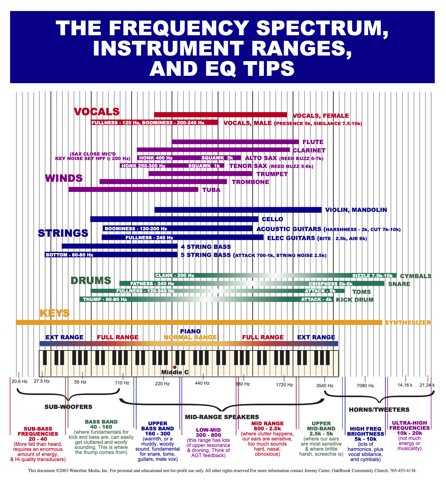
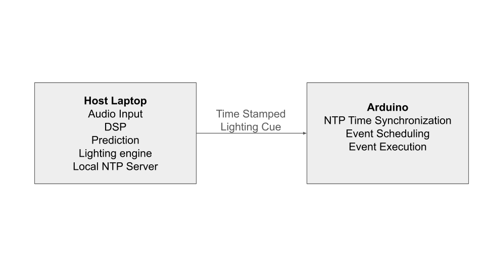
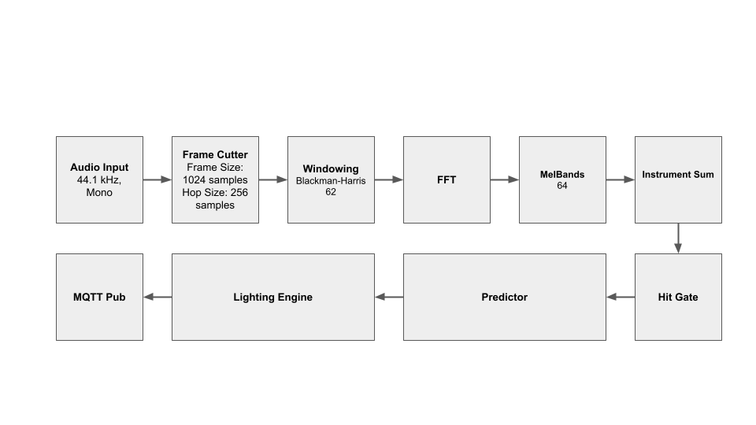
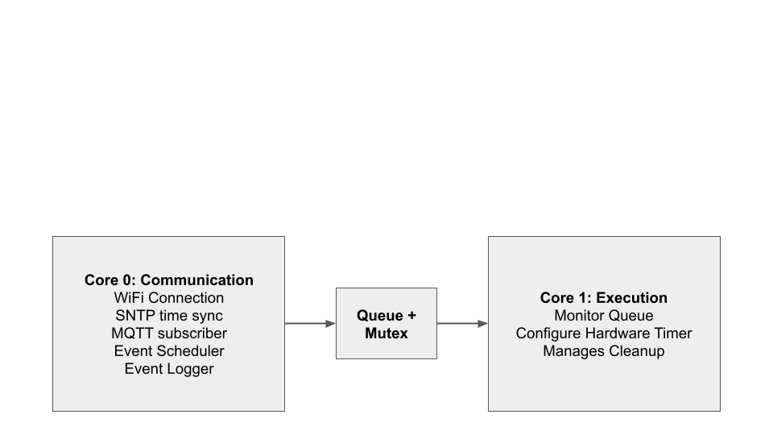
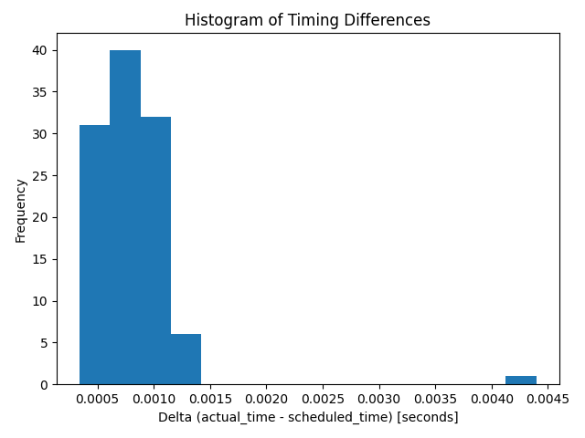

# **Predicting Percussive Events to Trigger Lighting Events on an Embedded Device**

## 👥 **Team**

- Kevin Box (kbox@ucla.edu, kbox13) 

---

## 📝 **Abstract**

This project presents an end-to-end system that sychnronizes audio cues and visual actions. It processes audio in real-time using an Essentia-based C++ pipeline to detect percussive events through FFT analysis and employs a Kalman filter-based prediction engine to forecast events approximately 100ms into the future. The system communicates predicted events via MQTT to an Arduino Nano ESP32 embedded device, which uses SNTP/NTP synchronization for coordinated timing. Key results demonstrate real-time event detection, partially successful prediction lookahead of ~100ms, and synchronized event execution. This work demonstrates a study in the ability to predict audio events and schedule predictions for lighting events. It shows the feasibility but ultimate inability to match the performance of hardwired reactive systems in its current state.

---

## 📑 **Slides**

- [Midterm Checkpoint Slides](https://docs.google.com/presentation/d/1x1JZpmhpEcW0shk7KxZ0RClFm7Pz_3GVdIKVPFMH_zg/edit?usp=sharing)  
- [Final Presentation Slides](https://docs.google.com/presentation/d/1bDlV3pmL7j9STCBg32i-ZQ4e6LoWrmRsvYoWTXp91ks/edit?usp=sharing)


---

## 🎛️ **Media**

- 


---

## **1. Introduction**

This project addresses the challenge of creating precisely timed lighting cues that synchronize with percussive moments in music. Unlike existing reactive systems that respond to audio events after they occur, this work explores predictive scheduling to enable visual synchronization despite network latency and processing delays.

### **1.1 Motivation & Objective**  

The goal of this project is to turn music into precisely timed lighting cues that "hit" with percussive moments. Current solutions fall into two categories: cheap, built-in auto modes that lack precision, and professional lighting solutions that require extensive manual programming. This work aims to bridge that gap by developing a system that can predict percussive events and schedule those predictions to trigger lighting events on an embedded device with precise timing.

The key objectives are to:

- Predict percussive events in real-time from streaming audio
- Schedule predictions to trigger events on an embedded device with precise timing
- Achieve visual synchronization between audio and embedded actions

### **1.2 State of the Art & Its Limitations**  

Existing approaches to audio-reactive lighting primarily fall into two categories:

1. **Cheap volume-based or energy-based sound reactive systems**: These systems use simple volume or energy detection to trigger lighting changes.

2. **Low-fidelity FFT-based  reactive methods**: These systems use frequency analysis but are reactive and are often have slow to respond or don't capture hits of the music well.

3. **Professional Systems** These systems are expensive and often require professional lights along with complicated configuration.

The key limitation to the first two systems is that they do audio processing on the lighting device to be reactive to the music. This limits the processing power availible to analyze the music. This leads to the  volume or energy based solutions which do not do well to synchronize to music. FFT based solutions suffer from low processing power often lagging behind or having poor resolution that create visually unappealing systems.
The key limitation of professional systems is the high financial barrier and the need for expert knowledge to configure them.

### **1.3 Novelty & Rationale**  

This work presents a new system that attempts to predict then schedule percussive events for lighting synchronization. The key innovation is the use of a prediction engine that forecasts percussive events approximately 1000ms into the future, allowing the system to compensate for network latency and processing delays. This improves the on device existing methods by utilizing the processing power of a host laptop for sophisticated musical analysis.

The system achieves this through:

- **Real-time streaming analysis** without pre-analysis of songs
- **Predictive event detection** that forecasts percussive events within 40ms accuracy, 1000ms in the future
- **Time synchronization** between host laptop and embedded device within 40ms
- **Visual synchronization** between audio and embedded action with ~40ms total delay

The rationale is that by predicting events far enough in advance, the system can schedule lighting cues to arrive at the embedded device before the actual audio event occurs, compensating for network and processing delays to achieve precise synchronization.

### **1.4 Potential Impact**  

If successful, this approach could enable a new class of audio-reactive lighting systems that combine the affordability of consumer-grade solutions with the precision of professional systems. The predictive scheduling methodology could be extended to other time-sensitive applications requiring synchronization between distributed systems, such as multi-device audio-visual installations, interactive performances, or synchronized multimedia experiences.

The technical contributions around time synchronization and predictive scheduling in resource-constrained embedded environments could also inform future work in real-time distributed systems and edge computing applications.

### **1.5 Challenges**  

Several significant challenges must be addressed:

1. **Real-time processing constraints**: The system must process audio in real-time without pre-analysis, requiring efficient streaming algorithms that can keep up with audio input rates (44.1 kHz).

2. **Prediction accuracy**: Predicting future percussive events relies on detecting periodic patterns, which may not always be present in music. Many hits can be missed, and the system is reliant on the assumption of periodicity.

3. **Time synchronization**: Achieving sub-40ms synchronization between a host laptop and an embedded device over a network requires precise clock synchronization and low-latency communication protocols.

4. **Network latency compensation**: MQTT communication introduces variable latency (typically 100-250ms), which must be predicted and compensated for through advance scheduling.

5. **Embedded device constraints**: The Arduino Nano ESP32 has limited computational resources and must handle time-critical event scheduling while managing communication tasks.

### **1.6 Metrics of Success**  

The project is evaluated across four dimensions:

1. **Accuracy of hit detection and prediction**: Comparison of detected and predicted hits against manually annotated ground truth, measured by:
   - Number of matched hits within tolerance windows (40ms and 250ms)
   - F1 scores comparing hits vs. ground truth, predictions vs. ground truth, and hits vs. predictions
   - Mean, standard deviation, and maximum timing errors

2. **Time synchronization accuracy**: Measurement of:
   - Mean offset between host and embedded device clocks
   - Round-trip latency of MQTT communication
   - Delay and latency statistics

3. **Execution precision**: On-device measurement of the difference between scheduled execution time and actual execution time, including mean, median, min, max, and standard deviation of execution delays.

4. **Visual synchronization**: Qualitative assessment of the visual appearance and perceived synchronization between audio events and lighting responses.

---

## **2. Related Work**

Professional lighting design systems use sophisticated algorithms to analyze audio. One such system created by limbic media is call the maestro system. This proprietary system reacts to audio to autonomously drive lighting. More information on their system can in the [maestro system description](https://limbicmedia.ca/aurora/maestro-technology/)

Beat or tempo retrieval is a well studied music information retrival (MIR) subject. These methods are similar to the percussive event detection that I implement in this project. One such implementation is BeatNet, which provides real time beat detection. Originally this was going to be used instead of a custom analysis pipeline however the project was pivoted due to the difference between tracking the beat and tracking percussive events. Links to the BeatNet [paper](https://arxiv.org/abs/2108.03576?) and [github](https://github.com/mjhydri/BeatNet) are availible. 

Instrument specific information retrieval is also a well studied problem in MIR. The instrument sum module makes use of instrument ranges that are well studied. Many websites and articles were referenced when building this module. An example chart is provided below in. 



*Figure: EQ chart showing frequency ranges of common instruments. This chart helps inform the instrument-specific signal processing modules used in the project.*

Time synchronization bewteen different devices has also been done before. This project uses time synchronization and characterization stategies presented in lecture. It also uses the NTP protocol to synchronize the time between laptop and embedded device.

---

## **3. Technical Approach**

This project integrates real-time audio signal analysis, predictive modeling, and robust networked execution to achieve tightly synchronized lighting responses to live music. Audio is captured and analyzed on a host laptop using digital signal processing (DSP) methods, percussive events are detected and predicted ahead of time, and commands are transmitted to an embedded device for precise cue execution. Key technical elements include low-latency streaming pipelines, time synchronization using NTP/SNTP protocols, prediction of future events to offset network delays, and resource-conscious event scheduling on the Arduino Nano ESP32. Each stage of the system is optimized to minimize timing errors and maximize reliability, ensuring a seamless translation from audio events to tightly choreographed lighting cues.


### **3.1 System Architecture**




The system consists of two main components: a host laptop that performs audio analysis and prediction, and an Arduino Nano ESP32 embedded device that executes lighting cues. Communication between these components occurs via MQTT, and time synchronization is maintained through an NTP server running on the host laptop.

**Host Laptop Components:**

- **Audio Input**: Captures laptop audio using Blackhole (virtual audio loopback driver) at 44.1 kHz in mono format
- **DSP Pipeline**: Processes audio frames using Essentia library
- **Prediction Engine**: Generates future percussive event predictions using Kalman filter-based period and phase estimation
- **Lighting Engine**: Converts predictions into lighting commands with confidence and latency filtering
- **MQTT Publisher**: Sends time-stamped lighting cues to the embedded device

**Arduino Nano ESP32 Components:**

- **Time Synchronization**: Uses SNTP to synchronize with the NTP server on the host laptop
- **MQTT Subscriber**: Receives time-stamped lighting cues from the host laptop
- **Event Scheduler**: Manages event queue and converts Unix timestamps to local execution times
- **Event Executor**: Monitors the event queue and triggers lighting actions at precise times

The system architecture follows a producer-consumer pattern where the host laptop produces predicted events with absolute timestamps, and the Arduino consumes and executes these events at the scheduled times. This design allows the system to compensate for network latency by scheduling events in advance.

### **3.2 Data Pipeline**

Data from the host laptop to the embedded device.

#### **3.2.1 Host Laptop Data Processing**



The audio processing pipeline operates on streaming audio data without requiring pre-analysis of songs. The pipeline processes audio in frames and extracts instrument-specific information to detect percussive events. The complete C++ code for the real-time streaming pipeline is available here: [`src/cpp/ess_stream/src/streaming_pipe.cpp`](../src/cpp/ess_stream/src/streaming_pipe.cpp). For a detailed explanation of the Essentia processing flow, see [Section 3.4.1](#341-essentia-streaming-processing-flow).

##### Audio Input Stage

- Audio is captured at 44.1 kHz sample rate in mono format
- A virtual audio loopback driver captures audio to prevent outside noise from getting into audio data
- No pre-analysis or buffering of entire songs is required

##### Frame Processing Stage

All frame processing algorithms are prebuilt Essentia building blocks chosen to get basic frequency information from the signal.

- **Frame Cutter**: Segments audio into frames of 1024 samples (about 23.2 ms at 44.1 kHz), with a hop size of 256 samples (about 5.8 ms at 44.1 kHz). This gives sample latency of 23.2ms with a sample every about 5.8ms or a sample rate of 172 Hz. The frame and hop size can be tuned to alter latency and spectrum precision of the frequency information.
- **Windowing**: Applies Blackman-Harris 62 window function to each frame to reduce spectral leakage
- **FFT**: Performs Fast Fourier Transform to convert time-domain signals to frequency domain
- **MelBands**: Extracts 64 mel-frequency bands from the FFT output, providing a perceptually-relevant frequency representation

##### Instrument Detection Stage

- **Instrument Sum**: The `InstrumentSum` algorithm aggregates 64 mel-frequency band energies into instrument-specific sums using multi-lobe Hann-weighted masks. It is availible here: [`src/cpp/ess_stream/src/instrument_predictor.cpp`](..src/cpp/ess_stream/src/instrument_predictor.cpp). The algorithm projects frequency ranges (defined in Hz) onto the mel filterbank by computing band center frequencies assuming linear spacing on the mel scale between 0 Hz and the Nyquist frequency (22.05 kHz at 44.1 kHz sample rate). Each instrument mask uses Hann windows with a configurable rolloff fraction (default 0.15) to create smooth transitions at frequency boundaries. The implementation supports five instruments:
  - Kick drum: Single lobe covering 40-75 Hz range (fundamental sub-bass frequencies)
  - Snare drum: Four weighted lobes: 180-280 Hz (0.35 weight), 350-600 Hz (0.10 weight), 2-5 kHz (0.35 weight), 6-10 kHz (0.20 weight)
  - Clap: Three lobes: 800-1.6 kHz (0.30), 2-6 kHz (0.50), 6-10 kHz (0.20)
  - Closed Hi-Hat (CHat): Three lobes: 3-6 kHz (0.25), 7-12 kHz (0.55), 12-16 kHz (0.20)
  - Open Hi-Hat/Crash (OHC): Three lobes: 3-6 kHz (0.25), 6-12 kHz (0.50), 12-16 kHz (0.25)
  
  The algorithm computes a weighted dot product between the mel band energy vector and each instrument's weight mask, producing five scalar values per frame (one per instrument). 

- **Hit Gate**: The `HitGateOnset` algorithm performs adaptive onset detection on each instrument's energy sum. It is availible here: [`src/cpp/ess_stream/src/hit_gate_onset.cpp`](..src/cpp/ess_stream/src/hit_gate_onset.cpp).
  
  The onset detection function (ODF) is smoothed using a configurable smoothing window. An adaptive threshold is computed using median and median absolute deviation (MAD) from a rolling history window (typically 48-64 frames). The threshold is calculated as `median + sensitivity × MAD`, where sensitivity is a configurable multiplier (typically 1.6-5.0). A hit is detected when the smoothed ODF exceeds the adaptive threshold and the instrument is not in a refractory period. Each instrument gate has independently tuned parameters:
  - Kick: threshold=10, refractory=30 frames, sensitivity=5, odf_window=64
  - Snare: threshold=1.4, refractory=4 frames, sensitivity=1.8, odf_window=64
  - Clap: threshold=1.4, refractory=3 frames, sensitivity=1.8, odf_window=48
  - Chat: threshold=1.6, refractory=3 frames, sensitivity=1.6, odf_window=48
  - OHC: threshold=1.5, refractory=4 frames, sensitivity=1.6, odf_window=64
  
  All gates output binary values (0.0 or 1.0) per frame, which are packed into a 5-element vector using `VectorPack5` for input to the predictor.

##### Prediction and Command Generation Stage

- **Predictor**: The `InstrumentPredictor` algorithm uses a Kalman filter-based approach to estimate period (inter-onset interval) and phase (position within the period) for each instrument independently. It is availible here: [`src/cpp/ess_stream/src/instrument_predictor.cpp`](../src/cpp/ess_stream/src/instrument_predictor.cpp). The state vector contains `[period, phase]`, where phase is normalized to [0, 1) representing position within one period. The algorithm maintains a sliding window of the last 20 hit times per instrument. Before prediction begins, the algorithm requires a warmup period with at least 8 hits (`min_hits_for_seed=8`) to compute initial statistics:
  - **IOI Statistics**: Inter-onset intervals (IOIs) are computed from consecutive hits, with median and MAD calculated for period estimation
  - **Initialization**: Period is initialized to the median IOI, phase to 0.0 (preferred impact phase), and covariance matrix P is initialized with period variance from MAD and small phase uncertainty (0.01)
  
  The Kalman filter operates in two steps:
  - **Predict Step**: Period drifts with small process noise (`qPeriod`), phase advances as `phase = (phase + dt/period) mod 1`, and covariance propagates accounting for period uncertainty affecting phase
  - **Update Step**: When a hit is observed, the measurement is the phase residual (difference from preferred phase 0.0). The measurement model H = [0, 1] indicates we only observe phase, not period directly. Measurement noise scales with IOI jitter: `R = rBase × (1 + periodMAD/period)`. The Kalman gain updates both period and phase estimates, with period clamped to BPM bounds (60-200 BPM).
  
  Predictions are generated by extrapolating forward from the current phase: `t_pred = t_current + (n × period)`, where n is chosen such that predictions fall within the horizon (2.0 seconds). Confidence is computed from the covariance matrix, representing uncertainty in the prediction timing. The algorithm generates up to 3 predictions per instrument (`max_predictions_per_instrument=3`) and only emits predictions when confidence exceeds a minimum threshold (0.3).

- **Lighting Engine**: The `LightingEngine` algorithm filters predictions and converts them to lighting commands with RGB color mapping. The filtering process applies three criteria:
  - Confidence Filtering: Only predictions above a certain confidence are considered. Currently configured to be ≥ 0.7 (`confidence_threshold=0.7`).
  - Latency Filtering: Predictions must fall within a given latency window. Currently Configured to be 0.7-2.0 seconds (`min_latency_sec=0.7`, `max_latency_sec=2.0`) relative to current processing time. This ensures sufficient lead time for network transmission while avoiding predictions too far in the future.
  - Duplicate Detection: Commands are deduplicated using an event ID generated from instrument name and rounded prediction time (10ms precision). If another command for the same instrument exists within a 0.4 second window (`duplicate_window_sec=0.4`), the new command is rejected. A cleanup process runs every 50 frames to remove old events from the duplicate tracking map.
  
  Each command is assigned an RGB color based on instrument (e.g., kick → red, snare → white). The algorithm maintains internal state tracking sent events to prevent duplicate transmissions.

- **MQTT Publisher**: The `MQTTPublisher` algorithm packages lighting commands into MQTT messages with absolute Unix timestamps. The implementation uses:
  - Broker Configuration: Connects to a localhost MQTT broker at `0.0.0.0:1883` (localhost)
  - Topic: Publishes to `beat/events/schedule` topic
  - Timestamping: Each command includes the predicted execution time as an absolute Unix timestamp, allowing the embedded device to schedule events precisely

#### **3.2.2 Embedded Device Data Processing**



The embedded device (Arduino Nano ESP32) receives lighting commands via MQTT and executes them at precise times using hardware timer interrupts. The system uses a dual-core architecture to separate communication and execution tasks, ensuring low-latency event scheduling while maintaining reliable network connectivity. The complete implementation is available in [`src/cpp/arduino/EmbeddedDevice/src/main.cpp`](../src/cpp/arduino/EmbeddedDevice/src/main.cpp).

##### MQTT Message Reception and Parsing

- MQTT Client Task (Core 0): The MQTT client runs on Core 0 at high priority (priority 2) and handles all network communication. It subscribes to three topics:
  - `beat/events/schedule`: Receives lighting command events with Unix timestamps
  - `beat/time/sync`: Receives time synchronization updates from the host
  - `beat/commands/all`: General command channel
  
- Message Parsing: When a message is received on `beat/events/schedule`, the system parses JSON-formatted event data containing:
  - `unix_time`: Absolute Unix timestamp in seconds
  - `microseconds`: Microsecond component of the timestamp
  - `event_id`: Unique identifier for the event (e.g., "kick_123.456")
  - `r`, `g`, `b`: RGB color values (0 or 1) for the LED channels
  
The parsed information is then used to schedule an event.

##### **Event Scheduling**

- Event Structure: Each scheduled event contains:
  - `execute_time_us`: Execution time in microseconds (from `micros()`)
  - `red`, `green`, `blue`: Boolean LED states
  - `event_id`: String identifier for logging and tracking
  
- Turn-On/Turn-Off Pair Generation: When a lighting command is received, the system generates two events:
  - Turn-On Event: Scheduled at `event_time - (LED_FLASH_DURATION_MS/2)`. This centers the flash around the predicted hit time.
  - Turn-Off Event: Scheduled at `event_time + (LED_FLASH_DURATION_MS/2)` .
  
- Event Queue Management: Events are inserted into a sorted array (`eventList`) using `insertEventSorted()`, which:
  - Maintains chronological order by `execute_time_us`
  - Uses mutex protection (`eventQueueMutex`) for thread-safe access
  - Supports up to 50 events (`MAX_EVENT_QUEUE_SIZE=50`)
  - Rejects events if the queue is full or if the turn-on time is in the past
  
- Past-Due Event Handling: Events with execution times in the past are skipped during scheduling to prevent executing stale commands. The system checks both turn-on and turn-off times before insertion.

##### **Event Execution**

- **Event Scheduler Task (Core 1)**: The scheduler runs on Core 1 at high priority (priority 2) and continuously monitors the event queue in a tight loop. The execution logic follows three steps:
  
  1. Current Event Check: If `nextEvent` is set, check if `micros() >= timerAlarmTime`. If true, execute the event, remove it from the queue, and clear `nextEvent`.
  
  2. Past-Due Event Recovery: Scan the queue for events with `execute_time_us <= micros()`. Execute any past-due events immediately to catch up if timing was missed.
  
  3. Next Event Configuration: If no event was just executed and the queue is not empty, configure the timer for the next scheduled event by setting `nextEvent` and `timerAlarmTime`.
  
- LED Control: The `executeEvent()` function controls the RGB LED by:
  - Setting GPIO pins directly using `digitalWrite()` with active-low logic (LOW=ON, HIGH=OFF for RGB LED)
  - Recording the actual execution time using `micros()` for logging
  - Creating a log entry with both scheduled and actual execution times


##### **Resource Synchronization**

The system uses three mutex-protected resources for safe inter-core communication:

- Time Synchronization Mutex: Protects `TimeSyncState` accessed by MQTT task (updates) and scheduler task (reads)
- Event Queue Mutex: Protects `eventList` and `eventCount` accessed by both MQTT task (insertion) and scheduler task (removal/peek)
- Log Queue: FreeRTOS queue providing thread-safe logging from Core 1 (execution) to Core 0 (MQTT publishing)

### **3.3 Algorithm / Model Details**

Algorithm details are mostly explained in the data flow section. Key algorithms are explained as follows:

- [Instrument Detection Stage](#instrument-detection-stage)
  - Instrument detector that turns raw spectrum into instrument specific spectrum. [`src/cpp/ess_stream/src/instrument_predictor.cpp`](..src/cpp/ess_stream/src/instrument_predictor.cpp)
  - Hit Gate that takes in frequency information and determines if there is a sharp increase in energy. [`src/cpp/ess_stream/src/hit_gate_onset.cpp`](..src/cpp/ess_stream/src/hit_gate_onset.cpp).
- [Prediction and Command Generation Stage](#prediction-and-command-generation-stage)
  - Predictor that predicts future hits using a Kalman filter based approach.
  - Lighting engine that turns predictions into future lighting events.

Additionally there are simple algorithms to convert between local time and unix time. This is done on laptop converting the relative essentia time since start to unix time. It is also done on the embedded device to turn unix timed commands to local `micros()` time.


### **3.4 Hardware / Software Implementation**

#### 3.4.1 Essentia Streaming Processing Flow

As explained above essentia is an Open-source library and tools for audio and music analysis. It is built from source at [essentia](../essentia/). 
Essentia's streaming mode uses a data-flow oriented architecture where algorithms are connected through sources and sinks, forming a directed graph that processes audio data incrementally. Unlike standard mode which processes entire audio files at once, streaming mode processes data frame-by-frame as it becomes available, making it ideal for real-time audio analysis. Algorithms communicate through typed sources and sinks. Sources produce data (e.g., `Source<Real>` for audio samples, `Source<vector<Real>>` for feature vectors), while sinks consume data (e.g., `Sink<Real>`, `Sink<vector<Real>>`). Connections are made using the `>>` operator: `algorithm->output("name") >> otherAlgorithm->input("name")`.The streaming system uses a pull-based consumption model. When a sink requests data, the scheduler traces back through the connection graph to find the source and executes all intermediate algorithms in the correct order to produce the requested data. This ensures efficient processing and automatic handling of dependencies.

- **Algorithm Chain**: The pipeline connects algorithms sequentially:
  1. `RingBufferInput` → `FrameCutter` (segments audio into frames)
  2. `FrameCutter` → `Windowing` (applies Blackman-Harris window)
  3. `Windowing` → `Spectrum` (computes FFT)
  4. `Spectrum` → `MelBands` (extracts 64 mel-frequency bands)
  5. `MelBands` → `InstrumentSum` (aggregates bands into instrument-specific sums)
  6. `InstrumentSum` → `VectorIndex` (extracts individual instrument values)
  7. `VectorIndex` → `HitGateOnset` (detects onsets per instrument)
  8. `HitGateOnset` → `VectorPack5` (packs 5 gates into single vector)
  9. `VectorPack5` → `InstrumentPredictor` (predicts future hits)
  10. `InstrumentPredictor` → `LightingEngine` (filters and converts to commands)
  11. `LightingEngine` → `MQTTPublisher` (publishes to MQTT broker)
  

#### 3.4.2 Arduino Device

The embedded device uses an Arduino Nano ESP32, which is based on the ESP32-S3 system-on-chip (SoC). This board provides dual-core processing, WiFi connectivity, and precise timing capabilities required for real-time event scheduling and execution. It has 14 GPIO pins and supports PWM, SPI, UART, I²C, and I²S  to provide for a wide range of event execution. The ESP32-S3's dual-core architecture enables separation of communication and execution tasks which ensures that network communication delays do not affect the precision of event execution timing. The ESP32-S3 runs FreeRTOS, providing: mutexes, semaphores, queues for inter-task communication, and configurable priorities (0-25, higher number = higher priority). It also conatins built-in ESP-IDF MQTT client library (`mqtt_client.h`) and SNTP client for time synchronization (`esp_sntp.h`).


#### 3.4.3 Time Synchronization

Time synchronization is performed by creating and connecting to a local NTP server on the host laptop. This is done using the package `chronyd` to setup and run a server. The chronyd configuration file is availble here: [`chrony.conf`](../src/thirdParty/chrony.conf). It is run by using the command:

```% sudo /opt/homebrew/sbin/chronyd -f src/thirdParty/chrony.conf -d -x```

The -x option denotes that the server will not try to control the system clock. This prevents the system clock from iterefering with the local NTP server timing which could create jumps and timing disagreements.  

- The Essentia pipeline synchronizes relative processing time (frame count × hop size / sample rate) to absolute Unix time using the NTP server running on the host laptop. The `InstrumentPredictor` receives the current absolute time and uses it for both hit timestamping and prediction generation.
- The Arduino synchronizes its local clock to the same NTP server using SNTP (Simple Network Time Protocol) to ensure consistent time reference across both systems. This allows the embedded device to compare scheduled event times with its synchronized local time for precise execution.

#### 3.4.4 MQTT Communication

Communication between host laptop and embedded device was performed using the MQTT protocol with a pub/sub architecture. The system uses Eclipse Mosquitto as the MQTT broker, running locally on the host laptop at. The broker configuration is available in [`src/thirdParty/mosquitto.conf`](../src/thirdParty/mosquitto.conf). It is run using the command:

```mosquitto -c src/thirdParty/mosquitto.conf -v```

The -v option is for verbose output which allows the user to view the connections and messages being sent across the network.

All messages use JSON format for structured data exchange. The MQTT publisher is implemented as a custom Essentia streaming algorithm (`MQTTPublisher`) in [`src/cpp/ess_stream/src/mqtt_publisher.cpp`](../src/cpp/ess_stream/src/mqtt_publisher.cpp). It uses the Paho MQTT C++ client library (`paho-mqttpp3`) for asynchronous message publishing. The embedded device uses the ESP-IDF MQTT client library (`mqtt_client.h`) for subscribing to topics. The implementation is in [`src/cpp/arduino/EmbeddedDevice/src/main.cpp`](../src/cpp/arduino/EmbeddedDevice/src/main.cpp). They communicate together using a publisher subscriber architecture. This pub/sub architecture decouples the host laptop (producer) from the embedded device (consumer), allowing the system to handle network latency by scheduling events in advance with absolute timestamps.

#### 3.4.5 Test Flow

There are 2 diffferent tests run to determine the performance of the system. The first test that runs the entire data pipeline and gathers information on the accuracy of the hit gate, predictor, and event execution. The second being the network latency and clock offset test which tests the communcation and time synchronization between the host laptop and embedded device.

##### Ground Truth Annotation

To create ground truth time steps, aided manual data annotation was performed. A given song was first run through the `demucs` program, to seperate the music into its instrument components.  This was done using [`kick_only_demucs.py`](../src/python/kick_only_gt_demucs.py) which seperates a `.wav` file into the bass, drum, vocal, and other components of a song. It then attempts to analyze the individual components of the song and provides a starting point for ground truth timestamps. Then the song is listened to and further annoted with the correct timestamps using the seperated stems. 

##### Full Pipeline Test

The full pipeline test evaluates the end-to-end accuracy of the system by comparing detected hits, predictions, and executed events against manually annotated ground truth data. This test measures the accuracy of hit detection, prediction generation, and event execution timing. Manually annotated kick drum hit times are stored in JSON files (e.g., [`testData/dontYouWorryChild/GT_dont_you_worry.json`](../testData/dontYouWorryChild/GT_dont_you_worry.json)) containing arrays of timestamps for each instrument.

To run this test the NTP server MQTT broker are run on the host laptop. The arduino is connected to the same network as the host laptop. The [python logging file](../src/python/event_execution_logger.py) is run to capture actual execution time on the embedded device.

The test audio file is played on the host laptop through system audio, which is captured by BlackHole virtual audio device and routed to the Essentia pipeline. During the test the `GateLoggerSink` algorithm ([src/cpp/ess_stream/src/gate_logger_sink.cpp](../src/cpp/ess_stream/src/gate_logger_sink.cpp)) logs all hit gate firings and predictions to a log. Each hit entry contains frame number, audio time, wall clock time. Each prediction entry contains predicted time, confidence intervals, and instrument. Sent lighting commands are logged by The `MQTTPublisher` algorithm ([src/cpp/ess_stream/src/mqtt_command_logger.cpp](../src/cpp/ess_stream/src/mqtt_command_logger.cpp)) command, writing the command exectuion times to a log. The embedded device publishes execution logs to MQTT topic `beat/events/execution_log`, which are captured by `event_execution_logger.py` and written to CSV files and contain expected vs actual event execution timings

The analysis is performed using [`hits_mqtt_comparison.py`](../src/python/hits_mqtt_comparison.py), which: Extracts instrument timings from JSON ground truth files. Parses log files for hit and prediciton timings. Calculates an alignment offset by matching the first detected hit to the first ground truth hit, accounting for audio start time differences.For each test set (hits, predictions, executions), matches timings to ground truth within a tolerance window, finding the closest ground truth hit for each detected/predicted/executed event.

Aditionally, [`analyze_kicks.py`](../src/python/analyze_kicks.py) is used to compare the expected vs actual event execution timings from the embedded device.

##### Network Latency and Clock Offset Test

The network latency and clock offset test measures the communication performance and time synchronization accuracy between the host laptop and embedded device. This test uses MQTT request-response patterns to measure round-trip latency and clock offset. The Arduino firmware is compile with the `ENABLE_LATENCY_TEST` flag enabled. Then `test_arduino_latency_sync` ([`src/cpp/ess_stream/src/test_arduino_latency_sync.cpp`](../src/cpp/ess_stream/src/test_arduino_latency_sync.cpp)) is run. The test sends timestamped messages the arduino T1, which then a time stamps and message T2/3 and then the message is sent pack to host, T4. Latency and offset are calculated from these timestamps. Results are printed to console with formatted statistics. Since the arduino echos straight back to the host, T2 and T3 are assumed equal and as such latency and delay are the same. Latency is given by `Latency = T4-T1` while delay is given by `Delay = (T4-T1)-(T3-T2)`. Offset is given by `Offset = ((T2-T1)+(T3-T4))/2` and cancels out symmetric network delay by averaging the forward and reverse path time differences. As such for the offset reporting, samples with large latency (>20ms) are disregarded as they violate the assumed symmetric delay.

### **3.5 Key Design Decisions & Rationale**

#### **3.5.1 Audio Analysis Framework**

The choice of Essentia as the audio analysis framework was driven by several critical requirements for real-time percussive event detection. Essentia provides a comprehensive, open-source C++ library specifically designed for audio and music information retrieval, making it well-suited for this application. Other beat detection algorithms were considered such as BeatNet however essentia was chosen due to its flexibility for analysis and customization.

#### **3.5.2 Dual Core Architecture**

The Arduino Nano ESP32 was chosen due to its  a dual-core ESP32-S3 processor and ability to utilize popular modern communication and sychronization methods. The system architecture explicitly separates communication and execution tasks across the two cores to achieve both reliable network communication and precise timing for event execution.

#### **3.5.3 Hardware Interrupts**

The system does not use hardware interrupts for precise event execution timing, and instead uses than polling-based approaches that check the current time in a loop. This design decision is was made due to the ease of implementation and the ability to have tight polling on a single core. This decision was confirmed with the results from the [on-device execution accuracy test](#42-on-device-execution-accuracy)

---

## **4. Evaluation & Results**

Evaluation is performed across four dimensions. First, the accuracy of hit detection and prediction is measured against manually annotated ground truth data to establish a baseline for system performance. This includes analyzing the number of detected and predicted hits compared to the ground truth, as well as timing accuracy metrics such as mean error, standard deviation, and maximum error. Second, the on-device execution accuracy is assessed by comparing the difference between scheduled event times and actual execution times, measuring how precisely the embedded device can execute events at their scheduled timestamps. Third, the accuracy of the time synchronization and communication system is evaluated by measuring mean clock offset, network delay, and round-trip latency between the host laptop and embedded device Finally, qualitative evaluation is performed through visual observation of the device's LED lighting response to detected hits, providing real-world validation of the system's end-to-end performance.

### **4.1 Accuracy of Hit Detection and Prediction**

Accuracy of hit detection and prediction was measured for the kick drum detection and prediction. This is done by comparing the [ground truth](#ground-truth-annotation) to detected and predicted timestamps as described in the [pipeline test](#full-pipeline-test) section. Results for 2 songs were gathered due to the labor intensive manual ground truth generation. Below you will find results for "[Call on Me](https://www.youtube.com/watch?v=qetW6R9Jxs4)" by Eric Prydz and "[Don't You Worry Child](https://www.youtube.com/watch?v=3mWbRB3Y4R8)" by Swedish House Mafia. These songs were chosen for difference in kick lines. "Call on Me" has a very pronounced easy to detect kick line whereas "Don't You Worry Child" has a much less pronounced and subtle kick line. In the results tolerances of 40ms and 250ms are used to compare results. 40ms is used as the target tolerance and 250ms is used as a marker within the BPM of the songs to not get missmatched beats. Hit is the timing of the concurrent detected hit, GT is the ground truth of hits, and Pred is the timing of the predicted hits.

#### 4.1.1 Table: Accuracy Results for "Call on Me"

| Comparison   | Tolerance | Matched | Total 1 | Total 2 | F1     | Mean     | Std      | Max       |
|--------------|-----------|---------|---------|---------|--------|----------|----------|-----------|
| HitvsGT      | 40 ms     | 216     | 243     | 216     | 0.9412 | 20.23 ms | 9.13 ms  | 39.18 ms  |
| PredvsGT     | 40 ms     | 78      | 201     | 216     | 0.3741 | 16.68 ms | 9.90 ms  | 38.51 ms  |
| HitvsPred    | 40 ms     | 82      | 243     | 201     | 0.3694 | 13.15 ms | 11.30 ms | 37.73 ms  |
| HitvsGT      | 250 ms    | 216     | 243     | 216     | 0.9412 | 20.23 ms | 9.13 ms  | 39.18 ms  |
| PredvsGT     | 250 ms    | 163     | 201     | 216     | 0.7818 | 74.85 ms | 71.17 ms | 233.68 ms |
| HitvsPred    | 250 ms    | 173     | 243     | 201     | 0.7883 | 72.88 ms | 72.22 ms | 246.49 ms |

#### 4.1.2 Table: Accuracy Results for "Don't you Worry Child"

| Comparison   | Tolerance | Matched | Total 1 | Total 2 | F1     | Mean     | Std      | Max       |
|--------------|-----------|---------|---------|---------|--------|----------|----------|-----------|
| HitvsGT      | 40 ms     | 14      | 241     | 284     | 0.0533 | 10.13 ms | 5.52 ms  | 17.97 ms  |
| PredvsGT     | 40 ms     | 20      | 177     | 284     | 0.0868 | 18.74 ms | 13.23 ms | 38.76 ms  |
| HitvsPred    | 40 ms     | 23      | 241     | 177     | 0.1100 | 20.63 ms | 12.30 ms | 39.80 ms  |
| HitvsGT      | 250 ms    | 144     | 241     | 284     | 0.5486 | 145.04 ms| 72.12 ms | 238.30 ms |
| PredvsGT     | 250 ms    | 99      | 177     | 284     | 0.4295 | 114.42 ms| 71.33 ms | 234.86 ms |
| HitvsPred    | 250 ms    | 126     | 241     | 177     | 0.6029 | 120.51 ms| 66.56 ms | 238.56 ms |

### **4.2 On-Device Execution Accuracy**

During the [full pipeline test](#full-pipeline-test), on device accuracy is measured by echoing the on device scheduled and on device actual time back to the host laptop for later processing. Results for this test can be seen below. 

#### 4.2.1 Table: Reuslts of On Device Execution Accuracy

| Mean        | Median      | Minimum      | Maximum      | Std Dev      |
|-------------|-------------|--------------|--------------|--------------|
| 0.802417 ms | 0.775933 ms | 0.340939 ms  | 4.396915 ms  | 0.417035 ms  |



### **4.3 Accuracy of Time Synchronization**

The network latency and clock offset is tested as described in [Network Latency and Clock Offset Test](#network-latency-and-clock-offset-test). This test was performed for 1000 samples with delay samples only being used for delay less than 20 ms (41 samples in given test). In the current test setup the embedded device and host laptop were connected to a mobile phone hotspot. Results may vary depending on the network used to connect devices.

#### 4.3.1 Table: Time Latency and Offset Results

| Samples | Metric  | Minimum   | Maximum    | Mean      | Std Dev   |
|---------|---------|-----------|------------|-----------|-----------|
|  1000   | Latency | 20.075 ms | 472.462 ms | 187.171 ms| 81.222 ms |
|   41    | Offset  | 0.295 ms  | 15.075 ms  | 5.984 ms  | 5.655 ms  |


## **5. Discussion & Conclusions**

### **5.1 What Worked Well**

Several key components of the system demonstrated successful performance. The core hypothesis that percussive events can be predicted far enough in the future to circumvent network delay was validated. The Kalman filter-based period and phase estimation successfully generated predictions with reasonable timing accuracy, particularly for songs with strong periodic patterns. The NTP-based time synchronization between the host laptop and embedded device achieved a mean clock offset of 5.984 ms with a standard deviation of 5.655 ms. This level of synchronization was sufficient for the application's timing requirements, allowing events to be scheduled with sub-10ms precision. The actual timing synchronization may be even better than this due to asymetric delays and the use of T2 = T3 in the offset calculation. The embedded device demonstrated excellent execution timing accuracy, with a mean execution delay of only 0.802 ms and a median of 0.776 ms. This indicates that once events are scheduled, the Arduino Nano ESP32 can execute them with high temporal precision. For songs with clear, periodic percussive patterns like "Call On Me," the hit detection achieved an F1 score of 0.9412 with a mean timing error of 20.23 ms. The instrument-specific frequency range analysis (kick: 40-75 Hz, snare: weighted frequency bands) proved effective for detecting percussive onsets in well-structured music.

### **5.2 What Didn't Work**

Several challenges emerged during development and evaluation. While prediction was feasible, the accuracy was limited. Prediction-to-ground-truth F1 scores ranged from 0.3741 (40ms tolerance) to 0.7818 (250ms tolerance) for "Call On Me," and were even lower for "Don't You Worry Child" (0.0868 to 0.4295). The system's reliance on the assumption of periodic hits means it struggles with music that has irregular or complex rhythmic patterns. Aditionally, on visual inspection, the system misses many hits and does not look very good overall. Performance varied significantly between songs. "Don't You Worry Child" showed poor hit detection performance (F1: 0.0533-0.5486 depending on tolerance), suggesting that the current instrument detection is not robust across different musical styles and production techniques. Additionally, only kick and snare detection are implemented, with kick being well-tuned and snare detection being untuned. The weighted frequency sum approach for snare (180-280 Hz, 350-600 Hz, 2-5 kHz, 6-10 kHz) needs further refinement to improve accuracy.

### **5.3 Future Work**

If given more time, several areas would benefit from further exploration. Implement and tune hit detection for additional instruments beyond kick and snare. Improve the snare detection tuning and develop detection methods for hi-hats, cymbals, and other percussive elements. This would make the system more versatile and applicable to a wider range of music. Enhance the Kalman filter-based predictor or explore more robust prediction algorithms. Consider machine learning approaches that could learn patterns from historical hit data, potentially handling non-periodic rhythms better than the current periodic assumption. Develop a more sophisticated lighting engine that is better tuned and incorporates more factors. Tune the  minimum latency and confidence thresholds to something that actually looks good visually. Add musical features like key, total energy, and harmonic content. Include more complex actions beyond simple on/off commands like dynamic intensity and color mapping based on musical characteristics. Replace the current loop-based event scheduler on the Arduino with precise hardware timer interrupts. This would provide more accurate event execution timing and reduce the variability in execution delay. Create ground truth annotations for a larger, more diverse set of songs spanning multiple genres by potentially Developing automated evaluation metrics that can assess visual synchronization quality.

This work demonstrates the feasibility of predictive percussive event detection for synchronized lighting, but significant improvements in prediction accuracy, instrument coverage, and robustness would be needed for a production-ready system. This also shows the reason for general use of both hardwired and reactive systems in the industry.

---

## **6. References**

### **6.1 Audio Processing Libraries**

**Essentia**  
Bogdanov, D., Wack, N., Gómez Gutiérrez, E., Gulati, S., Herrera Boyer, P., Mayor, O., ... & Serra, X. (2013). Essentia: An open-source library for sound and music analysis. *Proceedings of the 14th International Society for Music Information Retrieval Conference (ISMIR)*, 493-498.  

- Documentation: https://essentia.upf.edu/
- GitHub: https://github.com/MTG/essentia
- License: GPL v3

**BeatNet**  
Hydari, M. J., & Leistikow, R. (2022). BeatNet: A Real-Time Beat Tracking System. *IEEE/ACM Transactions on Audio, Speech, and Language Processing*, 30, 2899-2909.  

- GitHub: https://github.com/mjhydri/BeatNet

**madmom**  
Böck, S., Korzeniowski, F., Schlüter, J., Krebs, F., & Widmer, G. (2016). madmom: A new Python audio and music signal processing library. *Proceedings of the 24th ACM International Conference on Multimedia*, 1174-1178. 

- GitHub: https://github.com/CPJKU/madmom

**Demucs**  
Défossez, A., Usunier, N., Bottou, L., & Bach, F. (2019). Music source separation in the waveform domain. *arXiv preprint arXiv:1911.13254*.  

- GitHub: https://github.com/facebookresearch/demucs
- Used for ground truth generation via source separation

**librosa**  
McFee, B., Raffel, C., Liang, D., Ellis, D. P., McVicar, M., Battenberg, E., & Nieto, O. (2015). librosa: Audio and music signal analysis in python. *Proceedings of the 14th Python in Science Conference*, 18-25. 

- GitHub: https://github.com/librosa/librosa

**PyAudio**  
PortAudio Python bindings for cross-platform audio I/O.  

- GitHub: https://github.com/spatialaudio/pyaudio

**PortAudio**  
Bencina, R., & Burk, P. (2001). PortAudio—an open source cross-platform audio API. *Proceedings of the International Computer Music Conference*.  

- Website: http://www.portaudio.com/

### **6.2 Scientific Computing Libraries**

**NumPy**  
Harris, C. R., Millman, K. J., van der Walt, S. J., Gommers, R., Virtanen, P., Cournapeau, D., ... & Oliphant, T. E. (2020). Array programming with NumPy. *Nature*, 585(7825), 357-362.  

- Website: https://numpy.org/

**SciPy**  
Virtanen, P., Gommers, R., Oliphant, T. E., Haberland, M., Reddy, T., Cournapeau, D., ... & SciPy 1.0 Contributors. (2020). SciPy 1.0: fundamental algorithms for scientific computing in Python. *Nature Methods*, 17(3), 261-272.  

- Website: https://scipy.org/

**pandas**  
McKinney, W. (2010). Data structures for statistical computing in python. *Proceedings of the 9th Python in Science Conference*, 445, 51-56.  

- Website: https://pandas.pydata.org/

**Numba**  
Lam, S. K., Pitrou, A., & Seibert, S. (2015). Numba: A LLVM-based Python JIT compiler. *Proceedings of the Second Workshop on the LLVM Compiler Infrastructure in HPC*, 1-6.  

- Website: https://numba.pydata.org/

**Cython**  
Behnel, S., Bradshaw, R., Citro, C., Dalcin, L., Seljebotn, D. S., & Smith, K. (2011). Cython: The best of both worlds. *Computing in Science & Engineering*, 13(2), 31-39.  

- Website: https://cython.org/

### **6.3 Visualization Libraries**

**matplotlib**  
Hunter, J. D. (2007). Matplotlib: A 2D graphics environment. *Computing in Science & Engineering*, 9(3), 90-95.  

- Website: https://matplotlib.org/

**seaborn**  
Waskom, M. L. (2021). seaborn: statistical data visualization. *Journal of Open Source Software*, 6(60), 3021. 

- Website: https://seaborn.pydata.org/

**Vispy**  
Campagnola, L., & Peixoto, T. C. (2014). Vispy: Harnessing the GPU for fast, high-level visualization. *Python in Science Conference (SciPy)*.  

- GitHub: https://github.com/vispy/vispy

**PyQt6**  
Riverbank Computing. PyQt6 - Python bindings for the Qt application framework.  

- Website: https://www.riverbankcomputing.com/software/pyqt/

### **6.4 Communication & Networking Libraries**

**Eclipse Paho MQTT (Python)**  
Eclipse Foundation. Paho MQTT Python client library.

- Website: https://www.eclipse.org/paho/
- GitHub: https://github.com/eclipse/paho.mqtt.python

**Eclipse Paho MQTT C++**  
Eclipse Foundation. Paho MQTT C++ client library.  

- Website: https://www.eclipse.org/paho/
- GitHub: https://github.com/eclipse/paho.mqtt.cpp

**ZeroMQ (cppzmq)**  
Hintjens, P. (2013). *ZeroMQ: Messaging for Many Applications*. O'Reilly Media. 

- Website: https://zeromq.org/
- C++ bindings: https://github.com/zeromq/cppzmq

**pyzmq**  
Python bindings for ZeroMQ.  

- GitHub: https://github.com/zeromq/pyzmq

**ntplib**  
Python library for NTP time synchronization.

- GitHub: https://github.com/cf-natali/ntplib

### **6.5 MQTT Broker & Time Synchronization**

**Mosquitto**  
Eclipse Mosquitto - An open source MQTT broker. 

- Website: https://mosquitto.org/
- GitHub: https://github.com/eclipse/mosquitto

**chrony**  
chrony - A versatile implementation of the Network Time Protocol (NTP). 

- Website: https://chrony.tuxfamily.org/
- Documentation: https://chrony.tuxfamily.org/documentation.html

### **6.6 Embedded Systems & Arduino Libraries**

**ArduinoJson**  
Benoit Blanchon. ArduinoJson - JSON library for Arduino and embedded C++.  

- GitHub: https://github.com/bblanchon/ArduinoJson
- Version: 7.4.2

**Arduino ESP32**  
Espressif Systems. Arduino core for ESP32.  

- GitHub: https://github.com/espressif/arduino-esp32

**FreeRTOS**  
FreeRTOS - Real-time operating system for microcontrollers.  

- Website: https://www.freertos.org/

**PlatformIO**  
PlatformIO - Professional collaborative platform for embedded development. 

- Website: https://platformio.org/

### **6.7 Development Tools**

**Cursor AI Assistant**  
Cursor AI (Auto) - AI-powered coding assistant integrated into the Cursor IDE, used for code generation, documentation, and development assistance throughout this project. 

- Website: https://cursor.sh/
- Product: Cursor IDE with integrated AI assistant

**Chat GPT**
**GPT-5.1**  
OpenAI. GPT-5.1 - Large language model used for automated documentation and development assistance.

- Website: https://openai.com/research
- Model: GPT-5.1


### **6.9 Additional Dependencies**

All Python dependencies are listed in [`requirements.txt`](../requirements.txt) with version specifications. Key dependencies include:

---

# **7. Supplementary Material**

## **7.a. Datasets**

The two ground truth data sets created are availible in [testData/\*/GT_\*.json](../testData/). The associated testing results are also availible in their respective folders in [testData](../testData/).

## **7.b. Software**

All software libraries, frameworks, and tools used in this project are comprehensively cited in [Section 6: References](#6-references). This includes:

- **Audio Processing**: Essentia, BeatNet, madmom, Demucs, librosa, PyAudio, PortAudio
- **Deep Learning**: PyTorch, torchaudio
- **Scientific Computing**: NumPy, SciPy, pandas, Numba, Cython
- **Visualization**: matplotlib, seaborn, Vispy, PyQt6
- **Communication**: Eclipse Paho MQTT (Python & C++), ZeroMQ (cppzmq & pyzmq), ntplib
- **Infrastructure**: Mosquitto (MQTT broker), chrony (NTP server)
- **Embedded Systems**: ArduinoJson, Arduino ESP32, FreeRTOS, PlatformIO
- **Development Tools**: pytest, Black, flake8, Jupyter, tqdm, mido, CMake, Cursor AI Assistant

For complete citations, version information, and links, please refer to [Section 6: References](#6-references). All Python dependencies with version specifications are listed in [`requirements.txt`](../requirements.txt).

---

> [!NOTE] 
> Read and then delete the material from this line onwards.

# 🧭 **Guidelines for a Strong Project Website**

- Include multiple clear, labeled figures in every major section.  
- Keep the writing accessible; explain acronyms and algorithms.  
- Use structured subsections for clarity.  
- Link to code or datasets whenever possible.  
- Ensure reproducibility by describing parameters, versions, and preprocessing.  
- Maintain visual consistency across the site.

---

# 📊 **Minimum vs. Excellent Rubric**

| **Component**        | **Minimum (B/C-level)**                                         | **Excellent (A-level)**                                                                 |
|----------------------|---------------------------------------------------------------|------------------------------------------------------------------------------------------|
| **Introduction**     | Vague motivation; little structure                             | Clear motivation; structured subsections; strong narrative                                |
| **Related Work**     | 1–2 citations; shallow summary                                 | 5–12 citations; synthesized comparison; clear gap identification                          |
| **Technical Approach** | Text-only; unclear pipeline                                  | Architecture diagram, visuals, pseudocode, design rationale                               |
| **Evaluation**       | Small or unclear results; few figures                          | Multiple well-labeled plots, baselines, ablations, and analysis                           |
| **Discussion**       | Repeats results; little insight                                | Insightful synthesis; limitations; future directions                                      |
| **Figures**          | Few or low-quality visuals                                     | High-quality diagrams, plots, qualitative examples, consistent style                      |
| **Website Presentation** | Minimal formatting; rough writing                           | Clean layout, good formatting, polished writing, hyperlinks, readable organization        |
| **Reproducibility**  | Missing dataset/software details                               | Clear dataset description, preprocessing, parameters, software environment, instructions   |
